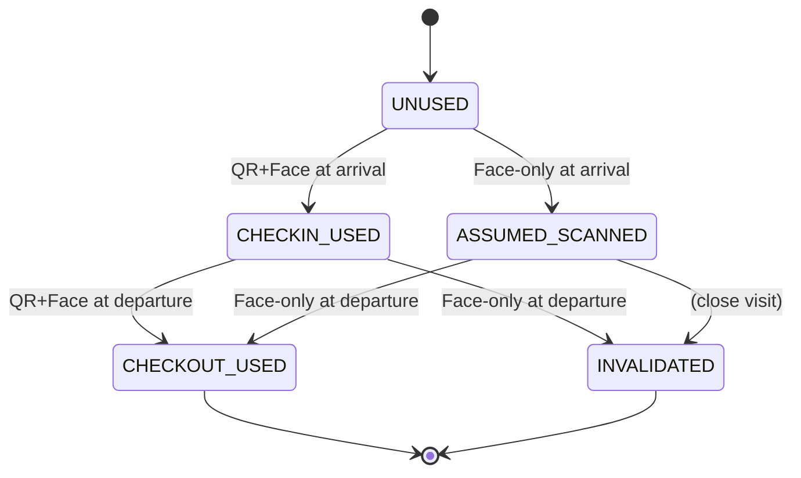

# Hybrid Face–QR Visitor Authentication Protocol (HFQVAP)

This document specifies the **Hybrid Face–QR Visitor Authentication Protocol** used at the reception gate. It defines states, transitions, and security rules, and compares the hybrid design to **face-only** and **QR-only** variants for research and evaluation.

---

## 1. Overview

The gate supports three configurable **authentication modes** (set via environment variable `AUTH_MODE`):

| Mode        | Arrival / Departure              | Use case                          |
|------------|-----------------------------------|-----------------------------------|
| `hybrid`   | Face and/or QR (with cross-check) | Default: best security + convenience |
| `face_only`| Face only; QR ignored             | Baseline: no QR lifecycle         |
| `qr_only`  | QR only; face not required        | Baseline: speed, no biometrics    |

The **hybrid** mode implements the full protocol below, including QR state machine and invalidation on misuse.

---

## 2. Protocol: State Diagram (QR Lifecycle)

QR codes are bound to a single visit and move through the following states. Terminal states are **CHECKOUT_USED** and **INVALIDATED**.



**State definitions:**

- **UNUSED** — QR issued, never scanned at gate.
- **CHECKIN_USED** — QR was scanned (or face+QR) at arrival.
- **ASSUMED_SCANNED** — Visitor used face-only at arrival; QR treated as “logically” used for this visit.
- **CHECKOUT_USED** — QR was scanned at departure (terminal).
- **INVALIDATED** — QR revoked (stolen/misuse/blacklist) (terminal).

---

## 3. Protocol: Sequence (High Level)

```mermaid
sequenceDiagram
    participant V as Visitor
    participant G as Gate
    participant DB as Firebase

    Note over V,DB: Registration & approval (outside protocol)
    V->>G: Present QR and/or face
    G->>G: Decode image, parse QR (if any)
    alt Hybrid: QR + Face
        G->>G: Validate QR (token, expiry, state)
        G->>G: Match face to visitors
        G->>G: Cross-verify: face_id == qr_visitor_id
        G->>DB: Update QR state (CHECKIN_USED / CHECKOUT_USED)
    else Face-only
        G->>G: Match face; no QR
        G->>DB: Set QR state ASSUMED_SCANNED (arrival)
    end
    G->>DB: Update visit status (checked_in / checked_out)
    G->>DB: Log transaction + auth_mode
    alt Face-only departure after QR arrival
        G->>DB: Invalidate QR (possible stolen)
        G->>DB: Log security alert
    end
```

---

## 4. Protocol Rules (Summary)

1. **Dual binding** — In hybrid mode, arrival is accepted only when face and QR (if presented) refer to the same visitor; otherwise access is denied and the QR is invalidated.
2. **Single use per phase** — Each QR is used at most once for arrival and once for departure; state transitions follow the diagram above.
3. **Invalidation on mismatch** — If face and QR identify different visitors, the QR is invalidated and a security alert is logged.
4. **Invalidation on face-only departure after QR arrival** — If the visitor used QR at arrival but presents only face at departure, the QR is invalidated (possible lost/stolen) and the event is logged.
5. **Blacklist** — If the visitor is blacklisted, access is denied and any presented QR is invalidated.
6. **Expiry** — QR is valid only until its expiry (visit date + configured hours); expired QR is rejected.

---

## 5. Threat Model

We consider the following threats and state how each variant (face-only, QR-only, hybrid) addresses them.

| Threat | Description | Face-only | QR-only | Hybrid |
|--------|-------------|-----------|---------|--------|
| **T1. QR theft / sharing** | Attacker uses another person’s QR (photo or physical) to enter. | N/A (no QR) | **High** — Anyone with the QR can enter. | **Mitigated** — Face must match the QR’s visitor; mismatch invalidates QR and denies access. |
| **T2. QR replay** | Reusing the same QR on another day or for another visit. | N/A | **Medium** — Mitigated by expiry and single-visit binding. | Same as QR-only (expiry + state). |
| **T3. Face spoofing** | Photo or video of the victim presented at gate. | **Medium** — Depends on liveness; out of scope here. | N/A (no face) | Same as face-only unless QR ties to identity. |
| **T4. No departure (tailgating)** | Visitor does not sign out; prolonged or unauthorized stay. | **Same** — No automatic mitigation; operational. | **Same** | **Same** — Visit status and logs support audit. |
| **T5. Stolen QR after entry** | Attacker steals QR inside premises and uses it to leave or re-enter. | N/A | **High** — QR alone allows departure. | **Mitigated** — Face-only departure after QR arrival invalidates QR and logs alert; QR cannot be reused. |
| **T6. Twin / ambiguous face** | Two visitors with similar faces; one could be mistaken for the other. | **High** — No disambiguation. | N/A | **Mitigated** — QR resolves identity when face match is ambiguous. |

**Summary:** Hybrid adds binding between face and QR and QR invalidation rules, improving security over QR-only (T1, T5) and over face-only (T6), while keeping the same face-spoofing and no-departure assumptions as the baselines.

---

## 6. Comparison Table (Security)

| Criterion | Face-only | QR-only | Hybrid |
|-----------|-----------|---------|--------|
| QR theft / sharing | N/A | Vulnerable | Mitigated (face–QR binding + invalidation) |
| QR replay | N/A | Mitigated (expiry, state) | Mitigated (expiry, state) |
| Face spoofing | Assumed handled elsewhere | N/A | Same as face-only |
| Stolen QR after entry | N/A | Vulnerable | Mitigated (invalidation on face-only departure) |
| Twin / ambiguous face | Vulnerable | N/A | Mitigated (QR disambiguation) |
| Audit trail | Visit + face match logs | Visit + QR scan logs | Visit + face + QR state + invalidations |

---

## 7. Implementation Notes

- **Configuration:** Set `AUTH_MODE=hybrid` (default), `AUTH_MODE=face_only`, or `AUTH_MODE=qr_only` in the Webcam app environment (e.g. `.env`).
- **Logging:** Arrivals, departures, and invalidations are logged with `auth_mode` and (in hybrid) QR state changes; see `research_protocol_events` (or equivalent) and `security_alerts` for export and analysis.
- **Paper / report:** This protocol can be cited as *Hybrid Face–QR Visitor Authentication Protocol (HFQVAP)* with the threat model and comparison above used as the research contribution.
